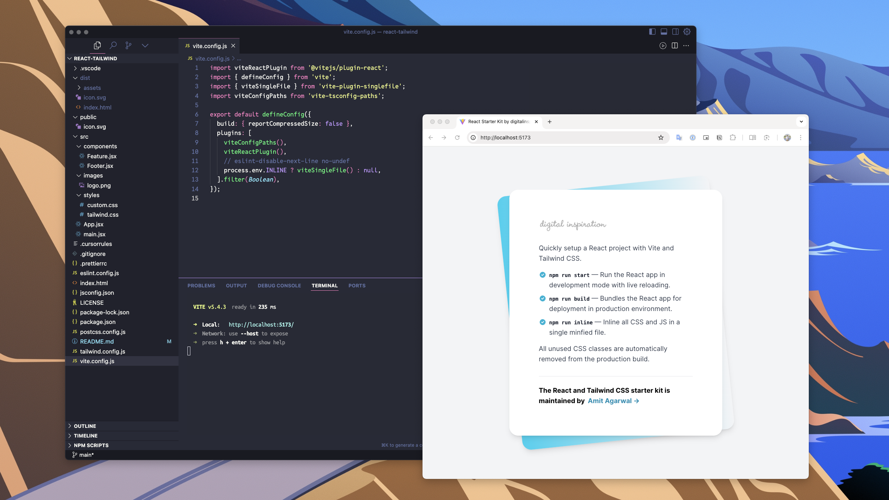

# 🚀 React and Tailwind Starter Kit

Quickly set up a new `React.js` project with Tailwind CSS using the [starter kit](https://github.com/labnol/react-tailwind). The project was bootstrapped with Vite (replacing Create React App) and it uses the `singlefile` plugin to inline all the JavaScript and CSS files into a single minified file.

The latest version of the starter kit is built with React 19 and Tailwind CSS 4.

## Live Demo

The [Digital Inspiration](https://digitalinspiration.com/) website is built with the Tailwind CSS, React.js and Vite. You can test the starter kit by opening the project in [StackBlitz](https://stackblitz.com/github/labnol/react-tailwind) or [CodeSandbox](https://codesandbox.io/p/sandbox/github/labnol/react-tailwind).

 

### Available `npm` commands

In the project directory, you can run:

#### `npm run start`

Runs the app in the development mode.

Open `http://localhost:5173` to view it in the browser. The page will reload if you make edits. You will also see any lint errors in the console.

#### `npm run build`

Builds the React app for production to the `build` folder. It correctly bundles React in production mode and optimizes the build for the best performance.

#### `npm run inline`

This command will inline all the JavaScript and CSS files from the production build into a single minified file.

## Connect with me

The React and Tailwind CSS starter is written by [Amit Agarwal](https://www.labnol.org/about).

     

If you have any questions or feedback, send an email at [amit@labnol.org](mailto:amit@labnol.org?subject=Tailwind+React).
